# Enterprise-Knowledge-Support-Agent Multi-Agent Workflow

This document provides a comprehensive technical walkthrough and workflow architecture of the agents inside the `core/agents/` directory (Intake Agent, Retrieval Agent, Synthesis Agent, Drafting Agent, Quality Gate Agent, and Escalation Agent), detailing how they are orchestrated in a deterministic, robust, and safe feedback-loop system.

---

## Architectural Workflow Diagram

The Mermaid graph below illustrates the complete lifecycle of a support ticket, mapping how it flows from input guardrails and caching layers through the LangGraph agent mesh down to output safety gates and downstream reinforcement feedback.

```mermaid
graph TD
    %% Premium Sleek Multi-Color Palette (Eliminating Black Backgrounds)
    classDef emerald fill:#064e3b,stroke:#10b981,stroke-width:2px,color:#f8fafc;
    classDef blue fill:#172554,stroke:#3b82f6,stroke-width:2px,color:#f8fafc;
    classDef purple fill:#2e1065,stroke:#a855f7,stroke-width:2px,color:#f8fafc;
    classDef slate fill:#0c4a6e,stroke:#0ea5e9,stroke-width:2px,color:#f8fafc;
    classDef gold fill:#451a03,stroke:#f59e0b,stroke-width:2px,color:#f8fafc;
    classDef rose fill:#4c0519,stroke:#f43f5e,stroke-width:2px,color:#f8fafc;
    classDef orange fill:#3b1307,stroke:#f97316,stroke-width:2px,color:#f8fafc;
    classDef cyan fill:#083344,stroke:#06b6d4,stroke-width:2px,color:#f8fafc;
    classDef darkgreen fill:#065f46,stroke:#34d399,stroke-width:2px,color:#f8fafc;
    classDef grey fill:#1e293b,stroke:#94a3b8,stroke-width:2px,color:#f8fafc;
    
    %% Entry Phase
    Start([Ticket Received]) --> InputGuardrails[Input Guardrails<br>PII Masking and Prompt Injection Check]
    InputGuardrails --> CircuitBreakerCheck{Circuit Breaker Check<br>Groq Provider Availability}
    
    %% Cache & Fast Track
    CircuitBreakerCheck -->|Yes| SemanticCacheCheck{Semantic Cache Check<br>Redis Cache Hit Verification}
    CircuitBreakerCheck -->|No| CircuitBreakerEscalation[Escalation Agent<br>Circuit Breaker Fallback]
    
    SemanticCacheCheck -->|Cache Hit| CacheFastReturn([Cache Fast Return])
    SemanticCacheCheck -->|Cache Miss| IntakeAgent[Intake Agent<br>Topic and Complexity Classification]
    
    %% Intake Routing
    IntakeAgent --> IntakeRouter{Intake Router}
    IntakeRouter -->|escalate| EscalationAgent[Escalation Agent<br>Triage and Handoff Creation]
    IntakeRouter -->|standard| RetrievalAgent[Retrieval Agent<br>Dynamic Budget Allocation]
    
    %% Retrieval & Reranking & Synthesis
    RetrievalAgent --> CrossEncoderReranking[Cross-Encoder Reranking<br>Semantic Relevance Re-scoring]
    CrossEncoderReranking --> SynthesisAgent[Synthesis Agent<br>Contradiction Resolution]
    
    SynthesisAgent --> SynthesisRouter{Synthesis Router}
    SynthesisRouter -->|need_more| RetrievalAgent
    SynthesisRouter -->|escalate| EscalationAgent
    SynthesisRouter -->|ready| DraftingAgent[Drafting Agent<br>Few-Shot Selector Prompting]
    
    %% Quality Gate, Grounding, Token Gate, and Citation Verification Loop
    DraftingAgent --> QualityGateAgent[Quality Gate Agent<br>Deterministic Safety Checklists]
    QualityGateAgent --> GroundingVerification[Grounding Verification<br>Natural Language Inference Check]
    GroundingVerification --> DeterministicTokenGate[Deterministic Token Gate<br>Technical Term Verbatim Verification]
    DeterministicTokenGate --> CitationAttributionVerifier[Citation Attribution Verifier<br>Inline Marker Validation]
    CitationAttributionVerifier --> QualityRouter{Quality Router}
    
    QualityRouter -->|revise<br>Max 3 Retries| DraftingAgent
    QualityRouter -->|escalate| EscalationAgent
    QualityRouter -->|approved| OutputFormatter[Output Formatter<br>Downstream Feedback Recording]
    
    %% Output Phase
    OutputFormatter --> OutputGuardrails[Output Guardrails<br>PII Leak and Grounding Verifiers]
    OutputGuardrails --> End([Customer Sent])
    CircuitBreakerEscalation --> OutputFormatter
    EscalationAgent --> OutputFormatter
    
    %% Assign classes to colors
    class Start,End emerald;
    class IntakeAgent,IntakeRouter blue;
    class RetrievalAgent,CrossEncoderReranking purple;
    class SynthesisAgent,SynthesisRouter,DraftingAgent slate;
    class QualityGateAgent,GroundingVerification,DeterministicTokenGate,CitationAttributionVerifier,QualityRouter gold;
    class InputGuardrails,OutputGuardrails rose;
    
    %% Non-Black Cache & Circuit Breaker / Escalation Assignments
    class SemanticCacheCheck,CacheFastReturn cyan;
    class CircuitBreakerCheck orange;
    class CircuitBreakerEscalation,EscalationAgent,OutputFormatter darkgreen;
```



---

## How to Export and Download This Flowchart

To save this high-resolution, vector-based workflow diagram as an image file (PNG, SVG, or PDF), follow these steps:

### Option 1 — Using the Mermaid Live Editor (Recommended)
1. **Copy the Mermaid Code:** Copy the full code block under the **Architectural Workflow Diagram** header above (starting with ````mermaid` and ending with ````).
2. **Open the Live Editor:** Navigate to [Mermaid Live Editor](https://mermaid.live/) in your web browser.
3. **Paste the Code:** Replace the default code in the left-hand text panel with the copied block.
4. **Download the Diagram:** Below the diagram preview panel on the right, click **Actions** and select:
   * **PNG:** For presentations, documentation, or social media sharing (e.g. LinkedIn).
   * **SVG:** For vector-based scaling (maintaining crystal-clear resolutions at any zoom).
   * **PDF:** For printing or sharing as a vector document.

### Option 2 — Inside Visual Studio Code
1. Install the extension **Markdown Preview Mermaid Support** (by Matt Bierner) or **Mermaid Preview** (by Thomas Wang).
2. Open this document in VS Code.
3. Open the Markdown Preview (`Ctrl + Shift + V` on Windows).
4. Right-click the rendered diagram and select **Save Image As** to save it directly.

---

## Step-by-Step Flowchart Terminology Guide

Below is a detailed breakdown of the complete ticket lifecycle, explained using the exact terms represented in each node of the flowchart.

### 1. Ticket Received
The entry point. A customer submits a raw support query (e.g. regarding Stripe Custom account API settings). This instantiates a new shared state containing the ticket text, customer tier, and meta information.

### 2. Input Guardrails (PII Masking and Prompt Injection Check)
Before any language model or retrieval search occurs, the ticket content runs through security filters. This step scans for and masks Personally Identifiable Information (PII) like physical addresses, social security numbers, and client secrets, while executing safety filters to block prompt injection exploits.

### 3. Circuit Breaker Check (Groq Provider Availability)
An active monitor that checks the health of the primary LLM provider (Groq). 
* **If it detects the API is offline (Circuit Breaker is OPEN):** It routes the flow immediately to **Circuit Breaker Escalation** to ensure graceful fallback handling.
* **If healthy (Circuit Breaker is CLOSED):** It allows the standard pipeline to proceed to the caching layer.

### 4. Circuit Breaker Escalation
A rapid-response mechanism that triggers when Groq is unavailable. It assigns an emergency human review status and passes the ticket directly to the **Output Formatter** to prevent downtime.

### 5. Semantic Cache Check (Redis Cache Hit Verification)
An efficiency layer that compares the MD5 hash of the incoming question against previously stored ticket responses in Redis.
* **Cache Hit:** If the exact or semantically duplicate ticket was successfully solved recently, it pulls the resolved draft from Redis, bypassing the entire multi-agent pipeline, and routes to **Cache Fast Return**.
* **Cache Miss:** If the ticket is unique, it proceeds to the main agent nodes starting with the **Intake Agent**.

### 6. Cache Fast Return
The fast-track terminal node. Instantly returns the cached, pre-approved customer draft with sub-millisecond response times.

### 7. Intake Agent (Topic and Complexity Classification)
The first agent node in the pipeline. It parses the ticket text and classifies the issue to assign primary topic, complexity category (simple, moderate, complex), and ticket urgency.

### 8. Intake Router
Evaluates the output of the Intake Agent classification:
* **Route "escalate":** If the ticket urgency is high and confidence is low, or if the topic is critical (e.g., account suspension, data loss), it transfers the ticket to the **Escalation Agent**.
* **Route "standard":** For standard support questions, it routes to the **Retrieval Agent**.

### 9. Escalation Agent (Triage and Handoff Creation)
Gathers the contextual state, records the classification details and failure reasons, and creates a highly structured markdown briefing for human support engineers.

### 10. Retrieval Agent (Dynamic Budget Allocation)
Queries the vector database (API Docs, Changelogs, GitHub, StackOverflow). Using the topic and complexity, it dynamically scales the search depth (depth budget) per source and fetches candidate documents.

### 11. Cross-Encoder Reranking (Semantic Relevance Re-scoring)
The secondary retrieval phase. Merges retrieved candidate chunks from all sources and scores them using a locally cached Hugging Face `sentence-transformers/all-MiniLM-L6-v2` cross-encoder network, sorting by actual semantic relevance to discard low-scoring noise and output only high-value documents.

### 12. Synthesis Agent (Contradiction Resolution)
Merges the reranked source documents, evaluates context coverage, and scans for high-severity contradictions. It resolves conflicts using a freshness priority rule (e.g., live changelogs override stale official guides).

### 13. Synthesis Router
Evaluates context readiness:
* **Route "need_more":** If the synthesis step identifies a key information gap, it loops back to the **Retrieval Agent** to perform a deeper, targeted query.
* **Route "escalate":** If it detects a critical contradiction that cannot be resolved automatically, it routes to the **Escalation Agent**.
* **Route "ready":** When context is complete and clean, it routes to the **Drafting Agent**.

### 14. Drafting Agent (Few-Shot Selector Prompting)
Generates the candidate reply. It calls a dynamic selector to inject gold-standard structural examples into the prompt template, applying age-decay and formatting filters. If the draft was previously rejected, it also reads warning details injected in the state to self-correct ungrounded claims.

### 15. Quality Gate Agent (Deterministic Safety Checklists)
Acts as the central automated quality inspector. It runs structured checklist checks (ensuring the answer is complete and appropriate) and passes the draft to the grounding verifiers.

### 16. Grounding Verification (Natural Language Inference Check)
The primary factual validation check. Compares the drafted response sentence-by-sentence against the retrieved source chunks using a Natural Language Inference (NLI) model, flagging any segment that asserts a technical claim not supported by the context.

### 17. Deterministic Token Gate (Technical Term Verbatim Verification)
The safety override layer. Scans the claims marked as "grounded" by the LLM and checks that all critical technical terms (snake_case/camelCase API parameters, endpoints, and headers) exist verbatim in the cited source texts. If a term is missing, it determinants overrides the LLM's decision, marking the segment ungrounded.

### 18. Citation Attribution Verifier (Inline Marker Validation)
Cross-references every inline citation marker (e.g. `[1]`, `[2]`) in the reply and verifies that the specific sentence containing the marker is actually backed by that cited source chunk, flagging citation mismatches and out-of-bounds indicators.

### 19. Quality Router
Validates the quality checklists and verifications:
* **Route "revise":** If the draft fails quality scoring or contains ungrounded claims, it loops back to the **Drafting Agent** (up to a maximum of 3 retries) with specific revision feedback.
* **Route "escalate":** If retries are exhausted or a safety check is completely blocked, it routes to the **Escalation Agent**.
* **Route "approved":** If the draft is safe, it routes to the **Output Formatter**.

### 20. Output Formatter (Downstream Feedback Recording)
Formats the final dictionary payload. In addition, it logs the synthesis confidence, quality score, and knowledge gaps into Redis to update downstream performance history for future query optimization.

### 21. Output Guardrails (PII Leak and Grounding Verifiers)
The final boundary shield. It double-checks that no internal sensitive database keys or PII have leaked into the formatted reply and applies a final strict validation trace before delivery.

### 22. Customer Sent
The terminal exit point of the active pipeline. The finalized support response is saved, cached, and returned to the caller.
